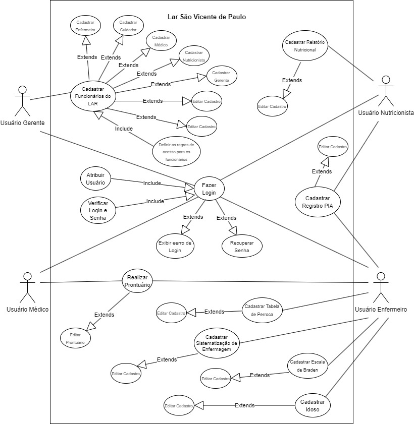
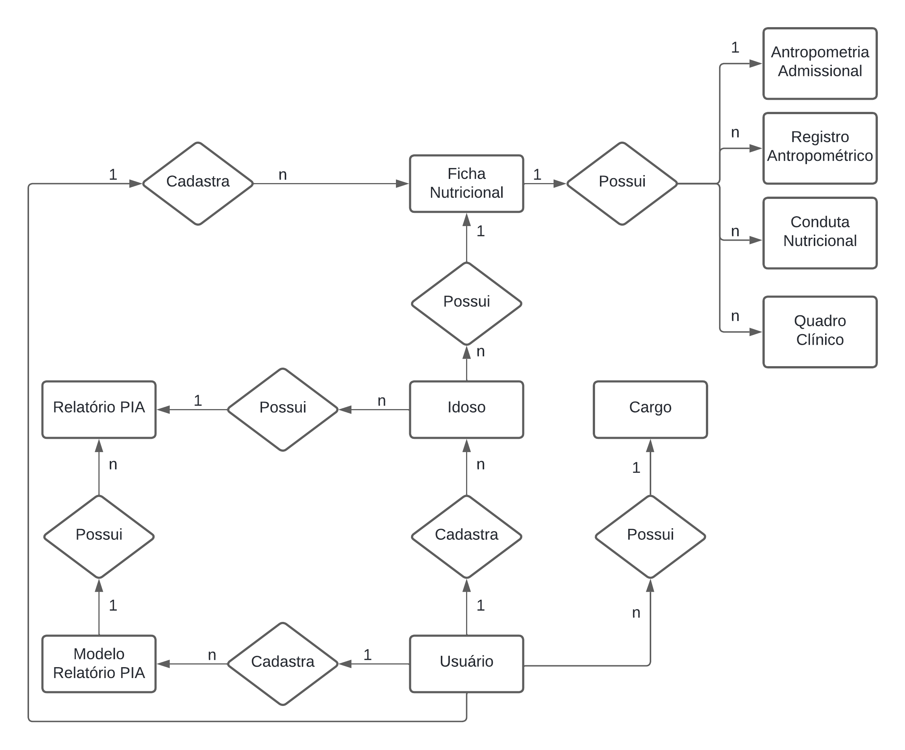
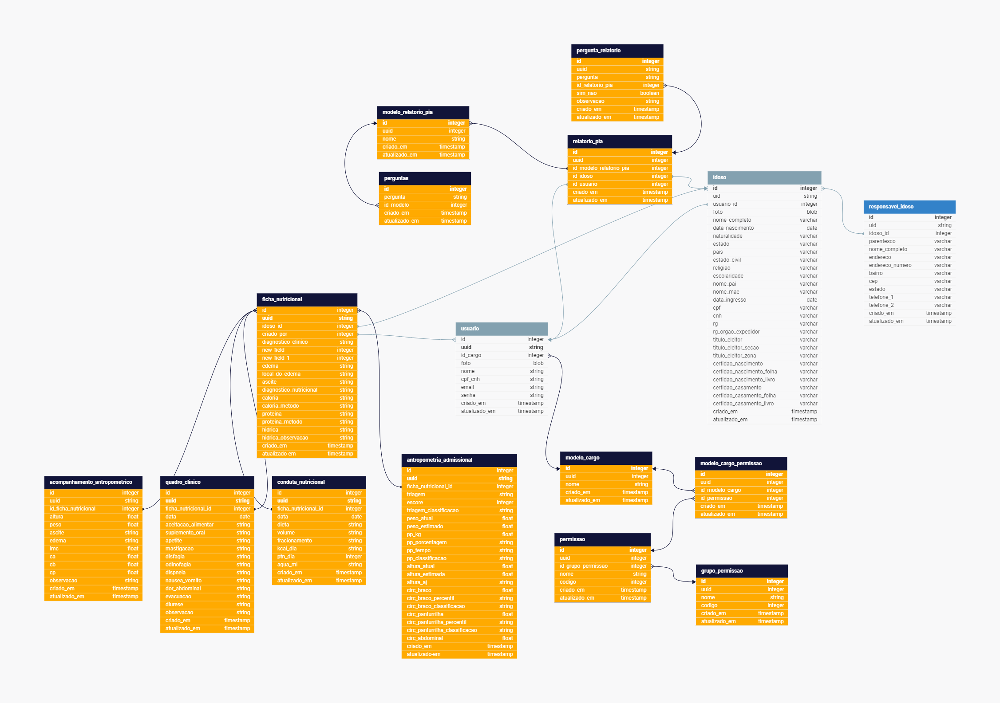

# Especificações do Projeto

Por meio da técnica de observação e brainstorming foram analisadas as necessidades dos usuários do sistema de forma a atender suas demandas.

## Arquitetura e Tecnologias

No projeto em questão, será adotada uma abordagem robusta e eficiente no que diz respeito ao armazenamento e gerenciamento de dados. Para tal, será utilizado um **banco de dados PostgreSQL**, estruturado e manipulado através do **framework Prisma**. Este conjunto oferece uma base sólida e confiável para a persistência e manipulação dos dados essenciais ao sistema.

Além disso, para a gestão segura de autenticação e autorização, será integrado ao projeto um **banco de dados Redis**. Esse banco será responsável pelo armazenamento de tokens de autenticação, garantindo um processo de login seguro e eficiente para os usuários do sistema.

No que diz respeito à construção da API, optamos pelo **framework NestJS** em conjunto com TypeScript. Essa escolha proporciona um ambiente de desenvolvimento altamente escalável, com uma estrutura organizada e orientada a padrões que facilita a criação e manutenção de APIs complexas.

Já para a construção do front-end do sistema, será utilizado o **framework NextJS**, novamente em conjunto com TypeScript. Essa combinação oferece uma experiência de desenvolvimento moderna e eficiente, possibilitando a criação de interfaces de usuário dinâmicas e responsivas.

Para garantir a segurança da conexão em redes locais dos clientes, será implementado um **middleware de IP Safelist**. Esse middleware terá a função de bloquear o acesso a partir de redes externas não autorizadas, reforçando assim a proteção dos dados e recursos do sistema contra acessos não autorizados.

Além das tecnologias mencionadas anteriormente, é importante destacar que todo o back-end do sistema será encapsulado em **Docker Containers**. Essa abordagem proporciona uma maior portabilidade e consistência do ambiente de desenvolvimento para o ambiente de produção.

Ao utilizar contêineres Docker, cada componente do back-end, será isolado em um ambiente controlado e independente. Isso simplifica o processo de implantação, escalabilidade e manutenção do sistema, permitindo uma gestão mais eficiente dos recursos e uma maior confiabilidade operacional.

A integração do Docker também facilita a colaboração entre os membros da equipe de desenvolvimento, garantindo que todos estejam trabalhando em um ambiente consistente e reproduzível. Essa abordagem contribui significativamente para a estabilidade e escalabilidade do projeto, proporcionando uma infraestrutura flexível e altamente automatizada.

## Project Model Canvas

## Requisitos

No projeto, sua estrutura e suas funções são determinadas a partir dos requisitos funcionais e não-funcionais.

Os requisitos funcionais podem ser definidos como a descrição das funções que os usuários poderão utilizar para satisfazer suas necessidades. Já os requisitos não funcionais são aqueles que descrevem as características de usabilidade e outros aspectos que o site necessita apresentar de maneira geral.

Portanto, com os estudos das personas e histórias dos usuários identificadas para o projeto, foram definidos os seguintes requisitos.

### Requisitos Funcionais

| ID     | Descrição do Requisito                                | Prioridade |
| ------ | ----------------------------------------------------- | -----------|
| RF-001 | Permitir cadastro de usuários com diferentes funções  | ALTA       |
| RF-002 | Permitir cadastro de idosos                           | ALTA       |
| RF-002 | Emitir relatórios relacionados ao paciente            | ALTA       |
| RF-003 | Criação de relatório PIA                              | ALTA       |
| RF-004 | Criação de Relatório Nutricional                      | ALTA       |
| RF-005 | Criação de Relatório Modelo para o PIA                | ALTA       |
| RF-006 | Tela Inicial com informaçãoes gerais sobre o Lar      | ALTA       |
| RF-007 | Relatório Nutricional subdivido em vários etapas      | ALTA       |
| RF-008 | Permissões configuradas via role                      | ALTA       |
| RF-009 | Alteração de senha via envio de email                 | ALTA       |
| RF-010 | Sistema de Login                                      | ALTA       |
| RF-011 | Upload de foto do idoso para fácil identificação      | ALTA       |
| RF-012 | Edição de todos os relatórios                         | ALTA       |
| RF-013 | Idoso deverá ter um responsável vinculado             | ALTA       |
| RF-014 | Emitir alertas de reavaliação para os profissionais   | BAIXA      |

### Requisitos não Funcionais

| ID      | Descrição do Requisito                                            | Prioridade |
| ------- | ----------------------------------------------------------------- | ---------- |
| RNF-001 | O sistema deve ser responsivo para rodar em um dispositivos móveis| MÉDIA      |
| RNF-002 | Deve ser uma aplicação web                                        | BAIXA      |
| RNF-003 | Acesso à aplicação apenas na rede interna da empresa              | ALTA       |

## Restrições

O projeto está restrito pelos itens apresentados na tabela a seguir.

| ID  | Restrição                                             |
| --- | ----------------------------------------------------- |
| 01  | Prazo de entrega até 23/06 deste a ano.               |
| 02  | Acesso restrito à rede local do cliente.              |
| 03  | Desenvolvimento como sistema web.                     |
| 04  | Compatibilidade com os navegadores da rede local.     |
| 05  | Restrições orçamentárias para o desenvolvimento.      |

## Diagrama de Casos de Uso

O diagrama de casos de uso é o próximo passo após a elicitação de requisitos, que utiliza um modelo gráfico e uma tabela com as descrições sucintas dos casos de uso e dos atores. Ele contempla a fronteira do sistema e o detalhamento dos requisitos funcionais com a indicação dos atores, casos de uso e seus relacionamentos.

## Modelo ER (Projeto Conceitual)

O modelo ER abaixo representa através de um diagrama como as entidades do sistema de relacionam entre si na aplicação, através deste também é possível verificar a cardinalidade entre as relações.

## Projeto da Base de Dados

O projeto da base de dados corresponde à representação das entidades e relacionamentos identificadas no Modelo ER, no formato de tabelas, com colunas e chaves primárias/estrangeiras necessárias para representar corretamente as restrições de integridade.

