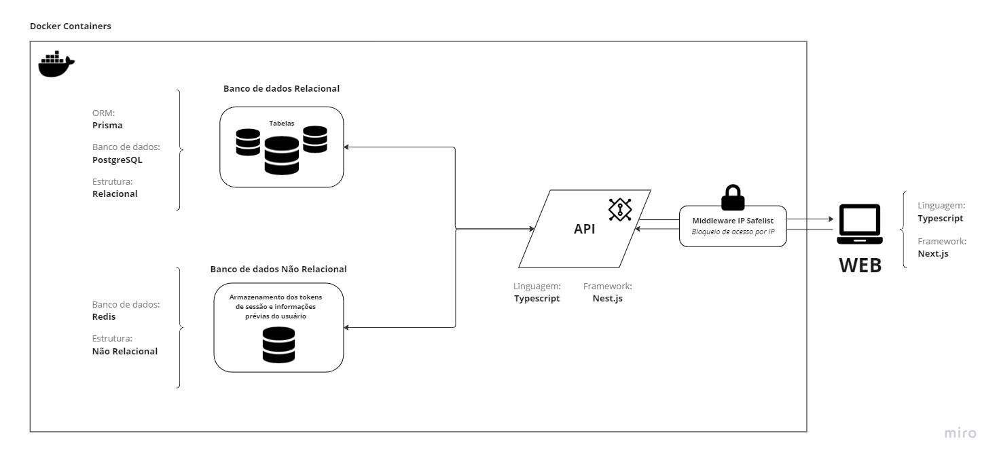
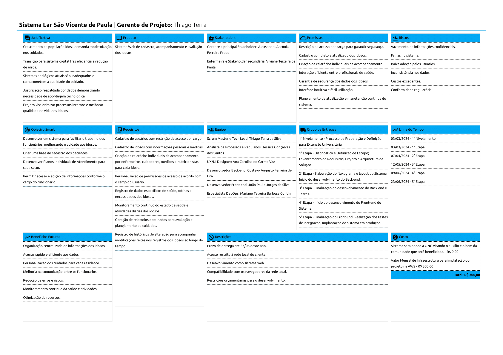

# Especificações do Projeto

Pré-requisitos: <a href="1-Documentação de Contexto.md"> Documentação de Contexto</a>

Por meio da técnica de observação e brainstorming foram analisadas as necessidades dos usuários do sistema de forma a atender suas demandas.

## Arquitetura e Tecnologias

No projeto em questão, será adotada uma abordagem robusta e eficiente no que diz respeito ao armazenamento e gerenciamento de dados. Para tal, será utilizado um **banco de dados PostgreSQL**, estruturado e manipulado através do **framework Prisma**. Este conjunto oferece uma base sólida e confiável para a persistência e manipulação dos dados essenciais ao sistema.

Além disso, para a gestão segura de autenticação e autorização, será integrado ao projeto um **banco de dados Redis**. Esse banco será responsável pelo armazenamento de tokens de autenticação, garantindo um processo de login seguro e eficiente para os usuários do sistema.

No que diz respeito à construção da API, optamos pelo **framework NestJS** em conjunto com TypeScript. Essa escolha proporciona um ambiente de desenvolvimento altamente escalável, com uma estrutura organizada e orientada a padrões que facilita a criação e manutenção de APIs complexas.

Já para a construção do front-end do sistema, será utilizado o **framework NextJS**, novamente em conjunto com TypeScript. Essa combinação oferece uma experiência de desenvolvimento moderna e eficiente, possibilitando a criação de interfaces de usuário dinâmicas e responsivas.

Para garantir a segurança da conexão em redes locais dos clientes, será implementado um **middleware de IP Safelist**. Esse middleware terá a função de bloquear o acesso a partir de redes externas não autorizadas, reforçando assim a proteção dos dados e recursos do sistema contra acessos não autorizados.

Além das tecnologias mencionadas anteriormente, é importante destacar que todo o back-end do sistema será encapsulado em **Docker Containers**. Essa abordagem proporciona uma maior portabilidade e consistência do ambiente de desenvolvimento para o ambiente de produção.

Ao utilizar contêineres Docker, cada componente do back-end, será isolado em um ambiente controlado e independente. Isso simplifica o processo de implantação, escalabilidade e manutenção do sistema, permitindo uma gestão mais eficiente dos recursos e uma maior confiabilidade operacional.

A integração do Docker também facilita a colaboração entre os membros da equipe de desenvolvimento, garantindo que todos estejam trabalhando em um ambiente consistente e reproduzível. Essa abordagem contribui significativamente para a estabilidade e escalabilidade do projeto, proporcionando uma infraestrutura flexível e altamente automatizada.

## Project Model Canvas

## Requisitos

As tabelas que se seguem apresentam os requisitos funcionais e não funcionais que detalham o escopo do projeto. Para determinar a prioridade de requisitos, aplicar uma técnica de priorização de requisitos e detalhar como a técnica foi aplicada.

### Requisitos Funcionais

| ID     | Descrição do Requisito                  | Prioridade |
| ------ | --------------------------------------- | ---------- |
| RF-001 | Permitir que o usuário cadastre tarefas | ALTA       |
| RF-002 | Emitir um relatório de tarefas no mês   | MÉDIA      |

### Requisitos não Funcionais

| ID      | Descrição do Requisito                                            | Prioridade |
| ------- | ----------------------------------------------------------------- | ---------- |
| RNF-001 | O sistema deve ser responsivo para rodar em um dispositivos móvel | MÉDIA      |
| RNF-002 | Deve processar requisições do usuário em no máximo 3s             | BAIXA      |

Com base nas Histórias de Usuário, enumere os requisitos da sua solução. Classifique esses requisitos em dois grupos:

- [Requisitos Funcionais
  (RF)](https://pt.wikipedia.org/wiki/Requisito_funcional):
  correspondem a uma funcionalidade que deve estar presente na
  plataforma (ex: cadastro de usuário).
- [Requisitos Não Funcionais
  (RNF)](https://pt.wikipedia.org/wiki/Requisito_n%C3%A3o_funcional):
  correspondem a uma característica técnica, seja de usabilidade,
  desempenho, confiabilidade, segurança ou outro (ex: suporte a
  dispositivos iOS e Android).
  Lembre-se que cada requisito deve corresponder à uma e somente uma
  característica alvo da sua solução. Além disso, certifique-se de que
  todos os aspectos capturados nas Histórias de Usuário foram cobertos.

## Restrições

O projeto está restrito pelos itens apresentados na tabela a seguir.

| ID  | Restrição                                             |
| --- | ----------------------------------------------------- |
| 01  | O projeto deverá ser entregue até o final do semestre |
| 02  | Não pode ser desenvolvido um módulo de backend        |

Enumere as restrições à sua solução. Lembre-se de que as restrições geralmente limitam a solução candidata.

> **Links Úteis**:
>
> - [O que são Requisitos Funcionais e Requisitos Não Funcionais?](https://codificar.com.br/requisitos-funcionais-nao-funcionais/)
> - [O que são requisitos funcionais e requisitos não funcionais?](https://analisederequisitos.com.br/requisitos-funcionais-e-requisitos-nao-funcionais-o-que-sao/)

## Diagrama de Casos de Uso

O diagrama de casos de uso é o próximo passo após a elicitação de requisitos, que utiliza um modelo gráfico e uma tabela com as descrições sucintas dos casos de uso e dos atores. Ele contempla a fronteira do sistema e o detalhamento dos requisitos funcionais com a indicação dos atores, casos de uso e seus relacionamentos.

As referências abaixo irão auxiliá-lo na geração do artefato “Diagrama de Casos de Uso”.

> **Links Úteis**:
>
> - [Criando Casos de Uso](https://www.ibm.com/docs/pt-br/elm/6.0?topic=requirements-creating-use-cases)
> - [Como Criar Diagrama de Caso de Uso: Tutorial Passo a Passo](https://gitmind.com/pt/fazer-diagrama-de-caso-uso.html/)
> - [Lucidchart](https://www.lucidchart.com/)
> - [Astah](https://astah.net/)
> - [Diagrams](https://app.diagrams.net/)

## Modelo ER (Projeto Conceitual)

O Modelo ER representa através de um diagrama como as entidades (coisas, objetos) se relacionam entre si na aplicação interativa.

Sugestão de ferramentas para geração deste artefato: LucidChart e Draw.io.

A referência abaixo irá auxiliá-lo na geração do artefato “Modelo ER”.

> - [Como fazer um diagrama entidade relacionamento | Lucidchart](https://www.lucidchart.com/pages/pt/como-fazer-um-diagrama-entidade-relacionamento)

## Projeto da Base de Dados

O projeto da base de dados corresponde à representação das entidades e relacionamentos identificadas no Modelo ER, no formato de tabelas, com colunas e chaves primárias/estrangeiras necessárias para representar corretamente as restrições de integridade.
