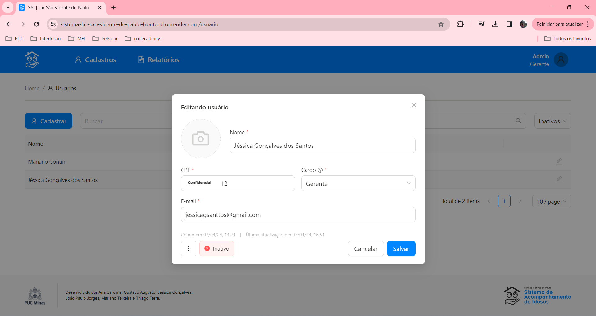
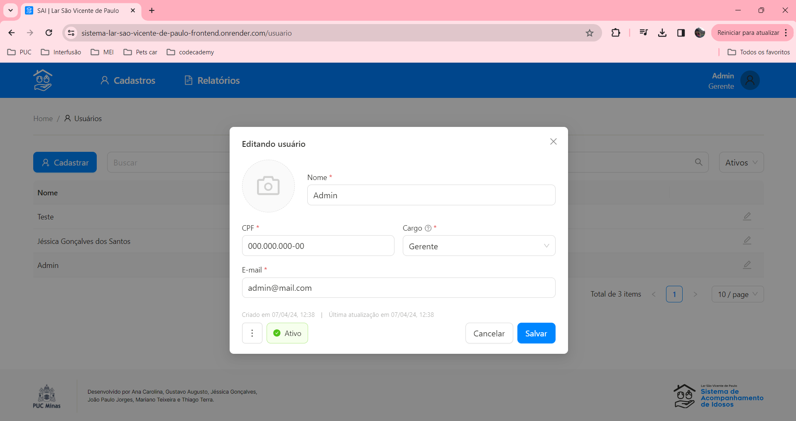
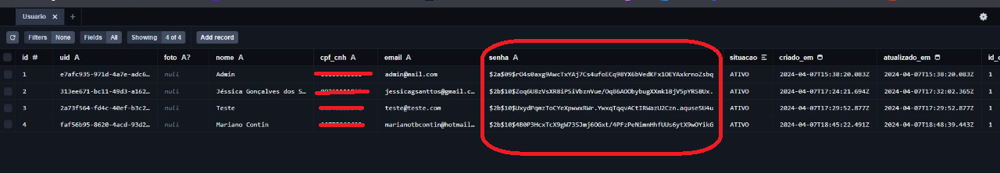

# Planos de Testes de Software

Apresente os cenários de testes utilizados na realização dos testes da sua aplicação. Escolha cenários de testes que demonstrem os requisitos sendo satisfeitos.

Enumere quais cenários de testes foram selecionados para teste. Neste tópico o grupo deve detalhar quais funcionalidades avaliadas, o grupo de usuários que foi escolhido para participar do teste e as ferramentas utilizadas.

# Sprint 1

Funcionalidades desenvolvidas:
## Login
## Listagem/Criação/Edição e Inativação de Usuários
## Listagem/Criação/Edição e exclusão de Cargos
## Filtros nas duas listagens

1. Verificar se a tela de login está responsiva
2. Verificar se é possível logar no sistema
3. Verificar se é possível cadastrar um usuário
4. Verificar se é possível editar um usuário
5. Verificar critérios mínimos para criação de senha
6. Verificar se é possível criar um cargo
7. Verificar se é possível editar um cargo
8. Verificar se é possível deletar um cargo
9. Verificar se é possível deletar um usuário
10. Verificar se é possível inativar um usuário
11. Verificar se é possível reativar um usuário inativado

    
    

13. Verificar se é possível criar usuários idênticos
    
     
15. Verificar se é possível utilizar o mesmo CPF para usuários diferentes

    
    
    
17. Verificar se é possível utilizar o mesmo e-mail para usuários diferentes

    
    
18. Verificar se há limites de caracteres adequados em campos de entrada, como nome de usuário, senha, e-mail

    
19. Verificar se há validação de formato para campos como e-mail 

    
    
      
20. Verificar se há mensagens de erro claras e informativas para casos de entrada inválida ou operações malsucedidas

    
    

21. Verificar se a sessão do usuário expira após um período de inatividade
    
    **Funcionalidade pendente, será testada somente em produção**

22. Verificar se há registros de auditoria para atividades importantes, como criação, edição e exclusão de usuários e cargos
    
    **Funcionalidade de auditoria pendente, será implementada na próxima sprint**
    
23. Verificar se os dados sensíveis, como senhas, são armazenados de forma segura, utilizando técnicas adequadas de criptografia e proteção
  

